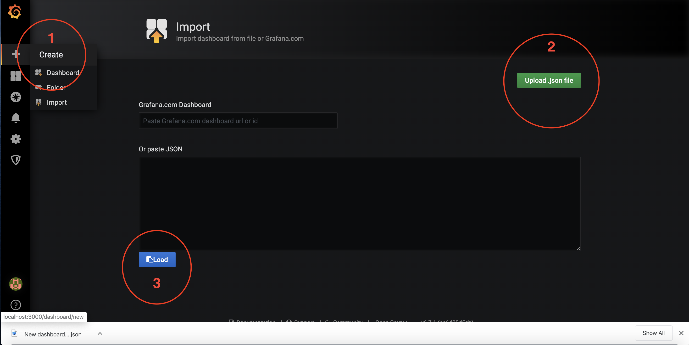

# Projeto SRE

## Como subir o Projeto SRE no seu computador local

Para começar, você deve instalar o [Docker](https://docs.docker.com/install/) no seu computador.

Feito isso, você irá precisar configurar três variáveis de ambiente:

* `API_KEY` e `API_SECRET_KEY` - Estas duas chaves são necessárias para fazer buscas por tweets usando a API do Twitter. Entre em https://developer.twitter.com e siga o passo a passo para obtê-las. 
* `HASHTAGS` - Aqui você irá informar as hashtags que a aplicação que insere os tweets no Banco de Dados irá utilizar separadas pelo caracter `;`.

Exemplos:

```bash
# Ambientes Unix-like (Linux e MacOS)
export API_KEY="ADJGHGHHGHG"
export API_SECRET_KEY="FFFSFDDFDG"
export HASHTAGS="#openbanking;#apifirst;#devops"
export HASHTAGS="#openbanking"
```

```dos
% Ambiente Windows
setx API_KEY "ADJGHGHHGHG"
setx API_SECRET_KEY "FFFSFDDFDG"
setx HASHTAGS "#openbanking;#apifirst;#devops"
setx HASHTAGS "#openbanking"
```

Para subir o ambiente completo, abra um terminal/prompt, vá para o diretório raiz do projeto e execute o comando `docker-compose up -d`. Feito isso, todas as aplicações ficarão disponíveis dentro de alguns segundos.

Repare que a aplicação responsável por inserir a cada 10 minutos um tweet no banco, leva pouco mais de 1 minuto para começar a fazer as buscas na API do Twitter e inserir os tweets no banco de dados. Isso é feito para que haja tempo suficiente para que o banco de dados esteja de pé quando a inserção de tweets começar a ser feita. Portanto, nesse curto período, consultas feitas à API REST não retornarão quaisquer dados.

Para que o envio de logs da API REST para o Graylog funcione corretamente, o Graylog deve ser configurado na primeira vez em que o ambiente for instanciado, conforme a próxima seção.

Ao finalizar, não esqueça de rodar o comando `docker-compose down` na raiz do projeto.

### Endpoints disponíveis para acesso

* API REST - Acesso por http://localhost:8080
* Aplicação Web - Acesso por http://localhost:8090
* Graylog - Acesso por http://localhost:9000 
* Grafana - Acesso por http://localhost:3000

### Como configurar pela primeira vez o Graylog para receber os logs da API REST (#configurar-graylog)

Em um browser qualquer, entre no endereço http://localhost:9000, preencha ambos os campos usuário e senha com o valor `admin`.

No painel superior, vá em `System` e depois clique em `Inputs`. Na próxima tela, clique em `Select Input`, selecione o valor `Gelf UDP` e clique em `Launch new input`.

Selecione então a opção `Global`, no campo `Title` dê um nome de sua preferência e clique no botão Save.

<p align="center">
  
</p>

<p align="center">
  
</p>

<p align="center">
  
</p>

### Como configurar pela primeira vez o Grafana com os dashboards de monitoração da API REST

Em um browser qualquer, entre no endereço http://localhost:3000, preencha ambos os campos usuário e senha com o valor `admin`.

No canto esquerdo da tela haverá um botão (+). Clique nele e em seguida clique em `Import`. Após isso clique no botão `Upload .json file`, selecione o arquivo `grafana-config.json` que se encontra no diretório `grafana` deste projeto e clique em `Load`.

<p align="center">
  
</p>

## Como rodar os testes automatizados

Para rodar os testes automatizados da aplicação que insere os tweets no banco de dados, execute o comando `docker-compose -f docker-compose.test.yml run --rm test_job` estando no diretório raiz do projeto.

Para rodar os testes automatizados da API REST, execute o comando `docker-compose -f docker-compose.test.yml run --rm test_api` estando no diretório raiz do projeto.

## Documentação da API REST

Uma vez que o ambiente esteja de pé, a API REST estará disponível no endereço http://localhost:8080.

### Obter os 5 usuários que mais tem seguidores

#### Requisição

`GET /what/users/most/followers`

#### Resposta

A resposta será dada em ordem decrescente da quantidade de seguidores que um usuário possui.

```json
HTTP/1.1 200 OK
Date: Thu, 20 Mar 2020 12:36:31 GMT
Status: 200 OK
Connection: close
Content-Type: application/json
Content-Length: 74

{"users":[{"user_followers_count":425435,"user_id":485475104,"user_name":"Ehi Kioya"},{"user_followers_count":338087,"user_id":1157784678,"user_name":"Microsoft Developer"}]}
```

### Obter o total de postagens agrupadas por hora do dia

#### Requisição

`GET /total/tweets/hour`

#### Resposta

A resposta será dada em ordem crescente da hora do dia.

```json
HTTP/1.1 200 OK
Date: Thu, 20 Mar 2020 12:36:31 GMT
Status: 200 OK
Connection: close
Content-Type: application/json
Content-Length: 98

{"hours":[{"count":69,"hour":0},{"count":30,"hour":1},{"count":11,"hour":2},{"count":2,"hour":3}]}
```

### Obter o total de postagens para cada uma das hashtags por idioma/país do usuário que postou

#### Requisição

`GET /total/tweets/hashtag/language/location/:user_id`

#### Resposta

Esta rota propositalmente não valida o caso em que o `user_id` não existe no banco de dados. Caso isso ocorra, o retorno será igual ao segundo exemplo desta seção.

```json
HTTP/1.1 200 OK
Date: Thu, 20 Mar 2020 12:36:31 GMT
Status: 200 OK
Connection: close
Content-Type: application/json
Content-Length: 163

{"infos":[{"tweet_info":{"count":1,"tweet_hashtag":"#openbanking","tweet_lang":"en"}},{"tweet_info":{"count":2,"tweet_hashtag":"#openbanking","tweet_lang":"pt"}}]}
```

```json
HTTP/1.1 500 INTERNAL SERVER ERROR
Date: Thu, 20 Mar 2020 12:36:31 GMT
Status: 500 INTERNAL SERVER ERROR
Connection: close
Content-Type: application/json
Content-Length: 36

{"message":"Internal Server Error"}
```

## Documentação da Aplicação Web

A aplicação Web pode ser acessada em qualquer browser no endereço http://localhost:8090.

Essa aplicação faz uma consulta à todas as rotas da API REST e exibe os resultados na mesma página. Para o caso da última rota, que obtém o total de postagens para cada uma das hashtags por idioma/país dado um usuário qualquer, há na aplicação Web um campo de texto disponível onde é possível colocar o identificador de um usuário e obter na mesma página as informações desta última rota.

