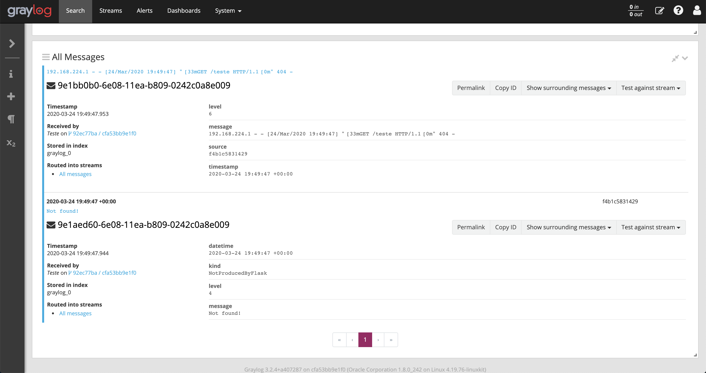
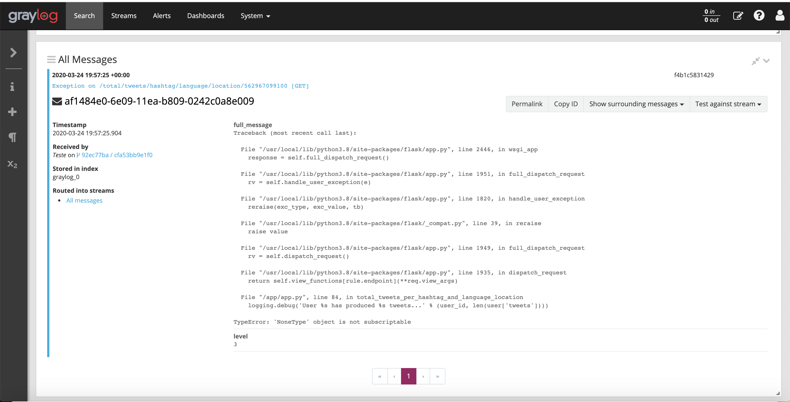

# Projeto SRE

## Como subir o Projeto SRE no seu computador local

Para começar, você deve instalar o [Docker](https://docs.docker.com/install/) no seu computador.

Feito isso, você irá precisar configurar três variáveis de ambiente:

* `API_KEY` e `API_SECRET_KEY` - Estas duas chaves são necessárias para fazer buscas por postagens usando a API do Twitter. Entre em https://developer.twitter.com e siga o passo a passo para obtê-las. 
* `HASHTAGS` - Aqui é necessário informar as hashtags que a aplicação que insere as postagens no Banco de Dados utilizará separadas pelo caracter `;`.

Exemplos:

```bash
# Ambientes Unix-like (Linux e MacOS)
export API_KEY="ADJGHGHHGHG"
export API_SECRET_KEY="FFFSFDDFDG"
export HASHTAGS="#openbanking;#apifirst;#devops"
export HASHTAGS="#openbanking"
```

```dos
% Ambiente Windows (PowerShell)
setx API_KEY "ADJGHGHHGHG"
setx API_SECRET_KEY "FFFSFDDFDG"
setx HASHTAGS "#openbanking;#apifirst;#devops"
setx HASHTAGS "#openbanking"
```

Para subir o ambiente completo, abra um terminal/prompt, vá para o diretório raiz do projeto e execute o comando `docker-compose up -d`. Feito isso, o mesmo ficará disponível dentro de alguns segundos.

Ao finalizar, não esqueça de rodar o comando `docker-compose down` estando no diretório raiz do projeto.

### Endpoints disponíveis para acesso

* API REST - http://localhost:8080
* Aplicação Web - http://localhost:8090
* Graylog - http://localhost:9000 
* Grafana - http://localhost:3000

## Como rodar os testes automatizados

Para rodar os testes automatizados da aplicação que insere as postagens no banco de dados, execute o comando `docker-compose -f docker-compose.test.yml run --rm test_job` estando no diretório raiz do projeto.

Para rodar os testes automatizados da API REST, execute o comando `docker-compose -f docker-compose.test.yml run --rm test_api` estando no diretório raiz do projeto.

## Documentação da API REST

### Obter os 5 usuários que mais tem seguidores

#### Requisição

`GET /what/users/most/followers`

#### Resposta

A resposta será dada em ordem decrescente da quantidade de seguidores que um usuário possui.

```json
HTTP/1.1 200 OK
Date: Thu, 20 Mar 2020 12:36:31 GMT
Status: 200 OK
Connection: close
Content-Type: application/json
Content-Length: 74

{"users":[{"user_followers_count":425435,"user_id":485475104,"user_name":"Ehi Kioya"},{"user_followers_count":338087,"user_id":1157784678,"user_name":"Microsoft Developer"}]}
```

### Obter o total de postagens agrupadas por hora do dia

#### Requisição

`GET /total/tweets/hour`

#### Resposta

A resposta será dada em ordem crescente da hora do dia.

```json
HTTP/1.1 200 OK
Date: Thu, 20 Mar 2020 12:36:31 GMT
Status: 200 OK
Connection: close
Content-Type: application/json
Content-Length: 98

{"hours":[{"count":69,"hour":0},{"count":30,"hour":1},{"count":11,"hour":2},{"count":2,"hour":3}]}
```

### Obter o total de postagens para cada uma das hashtags por idioma/país do usuário que postou

#### Requisição

`GET /total/tweets/hashtag/language/location/:user_id`

#### Resposta

Esta rota propositalmente não valida o caso em que o `user_id` não existe no banco de dados. Caso isso ocorra, o retorno será igual ao segundo exemplo desta seção.

```json
HTTP/1.1 200 OK
Date: Thu, 20 Mar 2020 12:36:31 GMT
Status: 200 OK
Connection: close
Content-Type: application/json
Content-Length: 163

{"infos":[{"tweet_info":{"count":1,"tweet_hashtag":"#openbanking","tweet_lang":"en"}},{"tweet_info":{"count":2,"tweet_hashtag":"#openbanking","tweet_lang":"pt"}}]}
```

```json
HTTP/1.1 500 INTERNAL SERVER ERROR
Date: Thu, 20 Mar 2020 12:36:31 GMT
Status: 500 INTERNAL SERVER ERROR
Connection: close
Content-Type: application/json
Content-Length: 36

{"message":"Internal Server Error"}
```

## Aplicação Web

Esta aplicação faz uma consulta à todas as rotas da API REST e exibe os resultados na mesma página. Para o caso da última rota da REST API, que obtém o total de postagens para cada uma das hashtags por idioma/país dado um usuário qualquer, foi disponibilizado nesta mesma página um campo de texto onde é possível colocar um identificador válido de um usuário e obter na mesma página as informações desta última rota.

<p align="center">
  
</p>

## Como usar o Graylog

### Como configurar pela primeira vez o Graylog para receber os logs da API REST

Acesse o [endereço local do Graylog](http://localhost:9000) e preencha ambos os campos usuário e senha com o valor `admin`.

No painel superior, vá em `System` e depois clique em `Inputs`.

<p align="center">
  
</p>

Na próxima tela, clique em `Select Input`, selecione o valor `Gelf UDP` e clique em `Launch new input`.

<p align="center">
  
</p>

Selecione então a opção `Global`, no campo `Title` dê um nome de sua preferência e clique no botão `Save`. A partir deste momento o Graylog já se encontra preparado para começar a receber os logs. Para começar a buscá-los, clique no botão `Search` na parte superior da tela.

<p align="center">
  
</p>

### Exemplos de logs vindos da REST API

Na figura abaixo podemos ver um exemplo de dois logs, um produzido pela própria biblioteca `Flask` de nível 6 (INFO) e outro produzido por código da própria API de nível 4 (WARNING).

<p align="center">
  
</p>

Na próxima figura é possível ver outro log, produzido também pela biblioteca `Flask` de nível 3 (ERROR). Nele está contido todo o `Stack Trace` de uma chamada à REST API que acabou ocasionando uma exceção que não está sendo tratada.

<p align="center">
  
</p>

## Como usar o Grafana

### Como configurar pela primeira vez o Grafana com os dashboards de monitoração da API REST

Acesse o [endereço local do Grafana](http://localhost:3000), preencha ambos os campos usuário e senha com o valor `admin`.

Clique na roldana no menu ao lado esquerdo, depois clique em `Data Sources` e em seguida clique em `Add data source`. 

<p align="center">
  
</p>

Então selecione o `Prometheus` como `Data Source`.

<p align="center">
  
</p>

No campo `URL` digite http://localhost:9090 e clique no botão `Save & Test`.

<p align="center">
  
</p>

Após isso, no canto esquerdo da tela há um botão (+). Clique nele e em seguida clique em `Import`. Após isso clique no botão `Upload .json file`, selecione o arquivo `grafana-config.json` que se encontra no diretório `grafana` deste projeto e clique em `Load`. Pronto! Clicando no símbolo do Grafana no canto superior esquerdo da tela, será possível acessar  o dashboard que acabou de ser importado.

<p align="center">
  
</p>

### Dashboards de Monitoração

Abaixo se encontra uma imagem do dashboard de monitoração criado para este projeto. Todos usam o `Prometheus` como `Data Source`. 

<p align="center">
  
</p>

A seguir é feita uma explicação de como cada dashboard foi criado:

* **Requests/s com sucesso** - Há um contador de requisições, o qual é possível filtrar por diferentes códigos de status. Logo, foi feito um filtro para considerar apenas os contadores de requisições com códigos de status igual à 200 e então calcular a taxa de requests/s com sucesso em intervalos de 30 segundos. 
* **Requests/s com erro** - Foi feito um filtro para considerar apenas os contadores de requisições com códigos de status que estejam entre 500 e 599 e então calcular a taxa de requests/s com erro em intervalos de 30 segundos.
* **Tempo médio de resposta de requests com sucesso** - Através de um contador de requisições e de um somador de todos os tempos de resposta com sucesso, foi possível calcular o tempo médio de resposta dividindo a taxa percentual do tempo que os requests levaram para completar dentro de um intervalo de 30 segundos pela quantidade de requests por segundo nesse mesmo intervalo de 30 segundos.
* **Uso de Memória** - Foi utilizada uma métrica que é atualizada a cada 15 segundos com a quantidade atual de uso de memória RAM da REST API.
* **Uso de CPU** - Foi utilizado um somador que fornece o tempo total de CPU gasto em segundos. Dessa forma foi possível mensurar em intervalos de 30 segundos o percentual desse tempo em que a CPU foi usada.

## Arquitetura

<p align="center">
  
</p>

Na figura acima é possível ter uma visão geral de como o projeto foi estruturado. A direção das setas e o rótulo indicam como as aplicações e bancos de dados interagem. Por exemplo, há uma seta que aponta do Grafana para o Prometheus com o rótulo de `Leitura`, indicando que o Grafana consome dados do Prometheus.

### Cadastro de usuários e postagens

A aplicação de coleta de postagens foi escrita em Python (versão 3.8) e é a responsável por consumir as postagens da API do Twitter dadas as hashtags informadas via variável de ambiente, e inseri-las em um banco de dados MongoDB (versão 4.2.3).

<p align="center">
  
</p>

Para atender os requisitos necessários, o MongoDB foi modelado para ter duas coleções, uma de usuários e a outra de postagens. Um usuário pode possuir uma ou mais postagens, enquanto uma postagem necessariamente está associada a um e apenas um usuário.

A coleta de postagens ocorre a cada 10 minutos para cada hashtag. Tanto as postagens como os usuários não são duplicados no banco de dados caso a API do Twitter retorne resultados idênticos em relação às coletas anteriores.

### Consumo de informações relativas à usuários e postagens

Para o consumo de informações relativas à usuários e postagens, uma API REST foi criada. Ela foi escrita em Python (versão 3.8) usando a biblioteca [Flask](https://palletsprojects.com/p/flask/). Os resultados são retornados sempre no formato JSON.

Além disso, uma Aplicação Web foi feita para consumir esta API REST e facilitar a interação dos usuários. Também foi escrita em Python (versão 3.8) e usa a biblioteca [Flask](https://palletsprojects.com/p/flask/).

O Web Server utilizado tanto na API REST, como na Aplicação Web, é o padrão que vem embutido no [Flask](https://palletsprojects.com/p/flask/) e não é adequado para ambientes de produção.

### Geração e consumo de métricas de desempenho

Para expor as métricas de desempenho da API REST, foi utilizada a biblioteca [prometheus_flask_exporter](https://github.com/rycus86/prometheus_flask_exporter). Seu uso é bastante simples e faz com que as métricas sejam expostas no path `/metrics` da API REST no formato entendido pelo [Prometheus](https://prometheus.io/).

O [Prometheus](https://prometheus.io/) é um sistema de código aberto que coleta e armazena métricas. No caso deste projeto, o mesmo foi configurado para coletar a cada 15 segundos as métricas disponíveis no path `/metrics` da API REST e armazená-las. A versão utilizada é a 2.16.0.

Uma vez que o [Prometheus](https://prometheus.io/) esteja coletando e armazenando as métricas, é possível configurá-lo como um `Data Source` no [Grafana](https://grafana.com/), e então criar dashboards de monitoração. A versão do [Grafana](https://grafana.com/) é a 6.7.1.

### Geração e consumo de logs

Para receber os logs gerados pela API REST, foi escolhido o [Graylog](https://www.graylog.org/), que é um concentrador e gerenciador de logs. Os mesmos são enviados no formato GELF (Graylog Extended Log Format) sobre UDP (podendo haver portanto eventual perda de logs).

O [Graylog](https://www.graylog.org/) utiliza dois bancos de dados, um MongoDB (vale ressaltar que não é utilizada a mesma instância que a API REST consome) e um ElasticSearch. O MongoDB é utilizado apenas para armazenar informações de configuração, como por exemplo informações dos usuários. Já o Elasticsearch é o banco de dados utilizado para efetivamente armazenar os logs recebidos. A versão utilizada do [Graylog](https://www.graylog.org/) é a 3.2.

Uma vez que o [Graylog](https://www.graylog.org/) esteja configurado adequadamente, é possível fazer consultas para buscar logs específicos.
